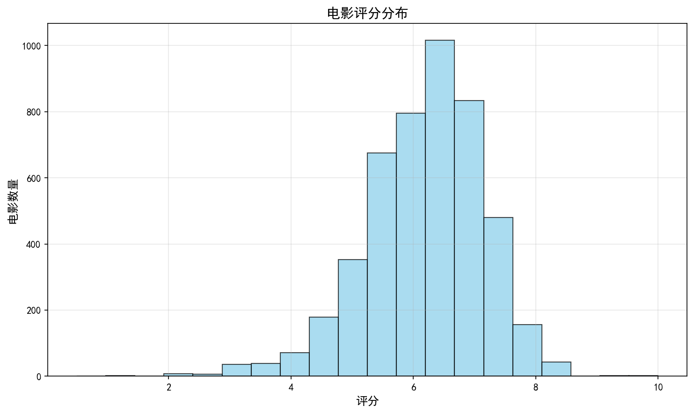
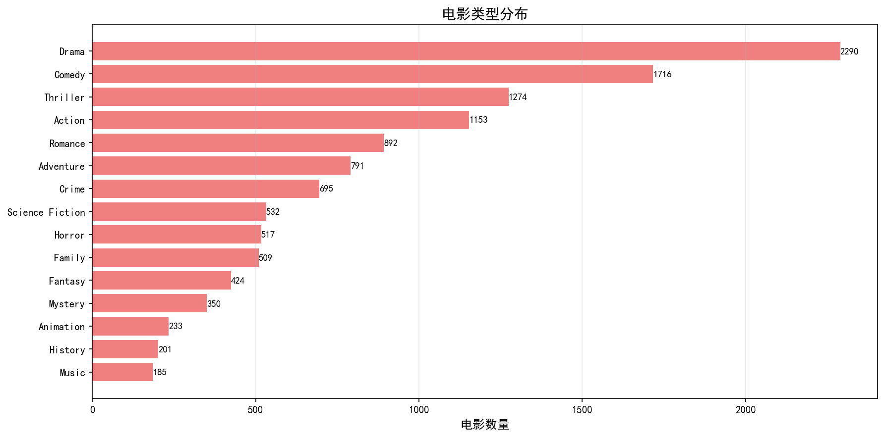
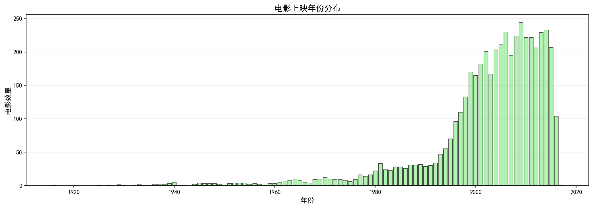
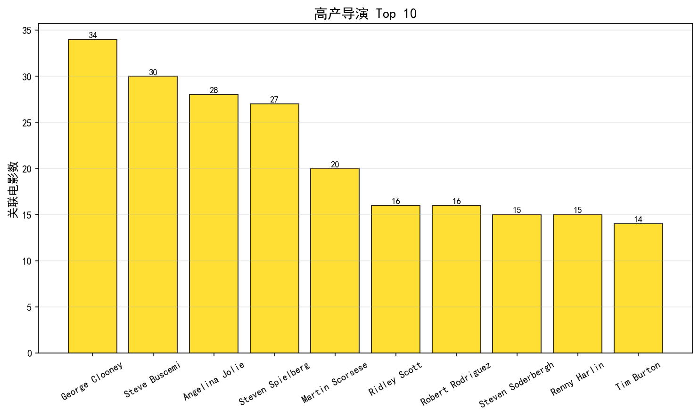
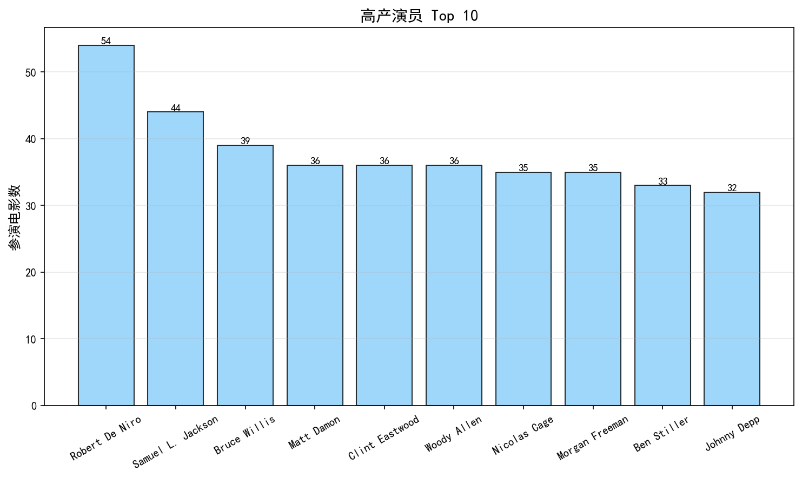
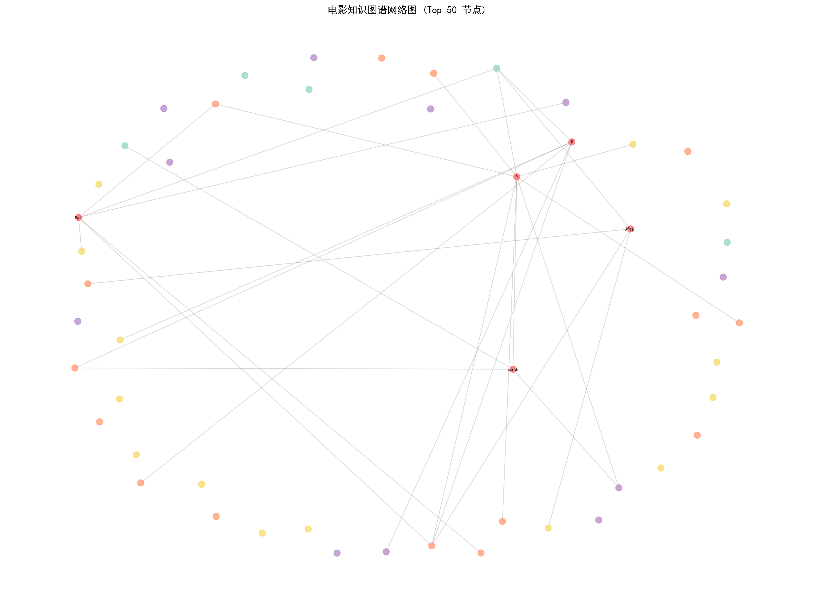
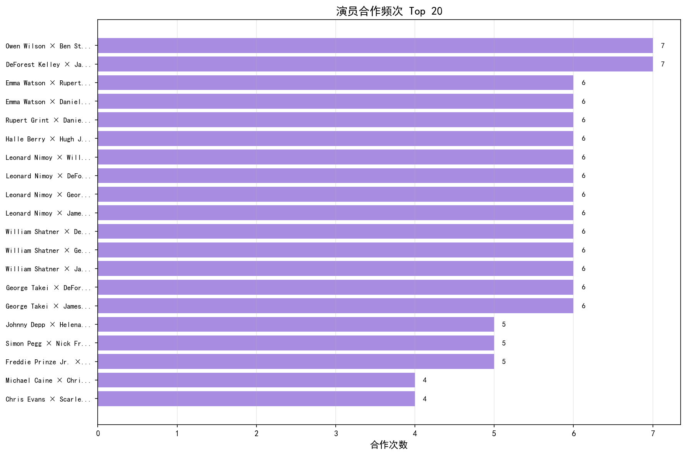
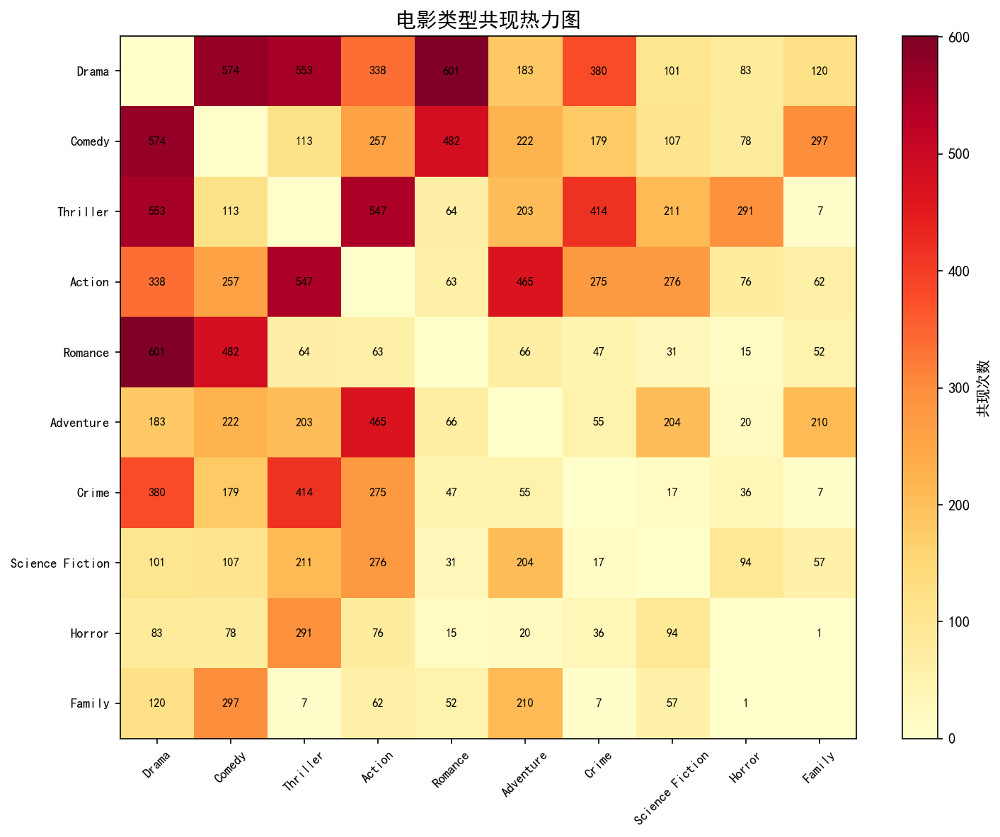

# 中文电影知识图谱构建与挖掘 —— 实验报告

> **课程**：《大数据原理与技术》
>
> **项目**：知识图谱构建与挖掘实践
>
> **数据源**：TMDB 5000 Movie Dataset（Kaggle 公开数据集）

---

## 一、小组成员分工

本项目包含 **7 个核心步骤**，按工作量平均划分为 **4 个任务模块**，每位成员负责一个模块：

| 成员姓名 | 负责模块 | 涉及步骤 | 核心工作内容 |
|:--------:|:--------:|:--------:|:-------------|
| ________ | **模块A：数据采集与预处理** | 第1步 + 第2步 | TMDB 5000 数据加载与解析、CSV 清洗与去重、jieba 分词与关键词提取、初始三元组构建 |
| ________ | **模块B：实体识别与关系抽取** | 第3步 + 第4步 | spaCy NER 实体识别（中文模型）、词典规则构建、正则模板匹配关系抽取、三元组补充与去重 |
| ________ | **模块C：知识图谱构建与查询可视化** | 第5步 + 第6步 | NetworkX/Neo4j 图谱构建、GEXF/GraphML 导出、5 类 Cypher 风格查询实现、PyEcharts 交互式可视化与 Matplotlib 统计图表 |
| ________ | **模块D：知识挖掘分析与报告整合** | 第7步 + 报告 | 演员合作网络分析、PageRank/Betweenness 中心度分析、类型关联挖掘（Apriori）、电影推荐系统、实验报告撰写 |

---

## 二、数据来源

### 2.1 主要数据源：TMDB 5000 Movie Dataset

本项目使用 Kaggle 公开数据集 **TMDB 5000 Movie Dataset**，包含两个核心文件：

| 文件 | 记录数 | 关键字段 |
|:----|:------:|:---------|
| [`tmdb_5000_movies.csv`](data/raw/tmdb_5000_movies.csv) | 4,803 条 | `id`, `title`, `genres`, `release_date`, `vote_average`, `production_countries`, `overview` |
| [`tmdb_5000_credits.csv`](data/raw/tmdb_5000_credits.csv) | 4,803 条 | `movie_id`, `cast`（演员表）, `crew`（职员表，含导演信息） |

### 2.2 回退方案：内置样例数据

当 TMDB 数据不可用时，自动回退到 [`data/sample_data/movie_sample_data.json`](data/sample_data/movie_sample_data.json) 中的 **100 部经典中文电影** 数据，涵盖《霸王别姬》《功夫》《无间道》等华语佳作。

### 2.3 数据样例

**TMDB 数据格式**（以 Avatar 为例）：

```
title: Avatar
year: 2009
rating: 7.2
director: James Cameron
actors: ["Sam Worthington", "Zoe Saldana", "Sigourney Weaver", ...]
genres: ["Action", "Adventure", "Fantasy", "Science Fiction"]
country: United States of America
```

**中文样例数据格式**（以《霸王别姬》为例）：

```
title: 霸王别姬
year: 1993
rating: 9.6
director: 陈凯歌
actors: ["张国荣", "张丰毅", "巩俐", "葛优", "蒋雯丽"]
genres: ["剧情", "爱情", "历史"]
country: 中国大陆
```

---

## 三、实验原理

### 3.1 知识图谱核心概念

**知识图谱（Knowledge Graph）** 是一种用图结构表示实体及其之间关系的技术体系。其基本表示形式为 **三元组（Triple）**：

```
(头实体, 关系, 尾实体)
```

例如：`(Avatar, 执导, James Cameron)`、`(霸王别姬, 主演, 张国荣)`

### 3.2 技术原理

| 技术 | 原理说明 |
|:----|:---------|
| **jieba 分词** | 基于前缀词典实现高效中文分词，采用动态规划查找最大概率路径，结合 HMM 模型处理未登录词 |
| **spaCy NER** | 基于 Transition-based 神经网络模型的命名实体识别，使用中文预训练模型 `zh_core_web_sm` |
| **正则关系抽取** | 通过预定义的语言模式模板（如 `"由...执导"`、`"主演..."`），从非结构化文本中匹配并抽取实体关系 |
| **NetworkX** | Python 图数据库，提供 MultiDiGraph（有向多重图）支持多关系类型的知识图谱存储与查询 |
| **PageRank** | Google 核心算法，通过图中节点间的链接关系计算节点重要性，迭代传播权重直到收敛 |
| **Betweenness Centrality** | 衡量节点作为图中最短路径桥梁的频率，反映节点在图中的信息控制能力 |
| **Apriori 关联规则** | 通过频繁项集挖掘发现类型间的共现模式，支持度 = 共现次数 / 总电影数 |

### 3.3 系统架构

```
┌─────────────────────────────────────────────────────┐
│                    数据采集层                         │
│  TMDB 5000 CSV / 样例 JSON → Pandas DataFrame        │
├─────────────────────────────────────────────────────┤
│                    数据处理层                         │
│  清洗去重 → jieba分词 → 关键词提取 → 初始三元组构建   │
├─────────────────────────────────────────────────────┤
│                    NLP 分析层                         │
│  spaCy NER 实体识别 → 词典规则匹配 → 正则关系抽取     │
├─────────────────────────────────────────────────────┤
│                    图存储层                           │
│  NetworkX 图 / 可选 Neo4j → GEXF/GraphML 导出        │
├─────────────────────────────────────────────────────┤
│                    应用层                             │
│  查询检索 → ECharts/Matplotlib 可视化 → 知识挖掘分析  │
└─────────────────────────────────────────────────────┘
```

---

## 四、实验过程

本项目共包含 **7 个步骤**，由 [`main.py`](main.py) 一键串联运行：

### 第1步：数据采集 [`src/01_data_collection.py`](src/01_data_collection.py)

**目标**：获取电影原始数据。

**操作**：
1. 尝试加载 `tmdb_5000_movies.csv`，解析 JSON 格式的 `genres`、`production_countries` 字段
2. 加载 `tmdb_5000_credits.csv`，从 `crew` 字段提取导演信息，从 `cast` 字段提取前 5 位主演
3. 过滤掉无导演信息的电影记录
4. 若 TMDB 数据不存在，自动加载内置的 100 部中文电影样例数据
5. 将结果保存为 [`data/raw/movies_raw.csv`](data/raw/movies_raw.csv)

### 第2步：数据预处理与三元组构建 [`src/02_data_preprocessing.py`](src/02_data_preprocessing.py)

**目标**：清洗数据并构建知识三元组。

**操作**：
1. **数据清洗**：年份/评分数值化、genres/actors 字段解析、缺失值填充、按标题去重
2. **关键词提取**：对电影描述（overview）进行 jieba 中文分词（或英文大写词提取），每部电影提取 Top 3 关键词
3. **三元组构建**：为每部电影生成以下 7 类三元组：

| 关系类型 | 示例 | 数量 |
|:--------|:-----|:----:|
| 执导 | (Avatar) → [执导] → (James Cameron) | 4,770 |
| 上映年份 | (Avatar) → [上映年份] → (2009年) | 4,770 |
| 制片国家 | (Avatar) → [制片国家] → (United States of America) | 4,617 |
| 评分 | (Avatar) → [评分] → (7.2分) | 4,720 |
| 主演 | (Avatar) → [主演] → (Sam Worthington) | 23,541 |
| 属于类型 | (Avatar) → [属于类型] → (Action) | 12,119 |
| 描述关键词 | (Avatar) → [描述关键词] → (Pandora) | 11,298 |

4. 输出清洗后数据 [`movies_cleaned.csv`](data/processed/movies_cleaned.csv)、关键词数据 [`movies_with_keywords.csv`](data/processed/movies_with_keywords.csv)、三元组 [`triples.csv`](data/processed/triples.csv)、统计信息 [`statistics.json`](data/processed/statistics.json)

### 第3步：实体识别 [`src/03_entity_recognition.py`](src/03_entity_recognition.py)

**目标**：从非结构化文本中识别命名实体。

**操作**：
1. 从结构化数据构建 **实体词典**（含 5 类实体：电影、导演、演员、类型、国家）
2. 尝试使用 **spaCy 中文模型** (`zh_core_web_sm`) 对电影描述进行 NER 识别
3. 同时使用 **基于词典的规则匹配** 识别已知实体
4. 合并 spaCy + 规则匹配的结果，去重后写入 [`movies_with_entities.csv`](data/processed/movies_with_entities.csv)

### 第4步：关系抽取 [`src/04_relation_extraction.py`](src/04_relation_extraction.py)

**目标**：从描述文本中抽取额外关系，补充三元组。

**操作**：
1. 预定义正则模式模板（如 `r"由(.{1,10})执导"`、`r"由(.{1,20})主演"` 等）
2. 对每部电影的描述文本进行模式匹配，抽取额外关系
3. 检查描述中是否提及其他已知电影，添加"提及"关系
4. 将新关系与原有三元组合并去重，输出 [`triples_enriched.csv`](data/processed/triples_enriched.csv)

### 第5步：知识图谱导入 [`src/05_kg_import.py`](src/05_kg_import.py)

**目标**：将三元组导入图数据库，构建知识图谱。

**操作**：
1. **Neo4j 模式**（可选）：连接 `bolt://localhost:7687`，使用 Cypher 语句 `MERGE` 创建节点和关系，建立索引
2. **NetworkX 模式**（默认）：使用 `nx.MultiDiGraph()` 构建有向多重图，每个节点附带类型属性
3. 导出图谱文件：
   - [`output/movie_knowledge_graph.gexf`](output/movie_knowledge_graph.gexf) — 可用 Gephi 打开
   - [`output/movie_knowledge_graph.graphml`](output/movie_knowledge_graph.graphml) — 标准 GraphML 格式
4. 导出节点列表 [`node_list.csv`](data/processed/node_list.csv) 和边列表 [`edge_list.csv`](data/processed/edge_list.csv)

### 第6步：查询与可视化 [`src/06_visualization.py`](src/06_visualization.py)

**目标**：执行示例查询并生成可视化图表。

**操作**：
1. **5 类示例查询**：
   - 查询演员参演电影（如 Tom Hanks）
   - 查询导演作品（如 Steven Spielberg）
   - 查询电影详细信息（如 The Shawshank Redemption）
   - 查询两人合作作品（如 Christopher Nolan × Leonardo DiCaprio）
   - 基于类型的电影推荐
2. **生成 Matplotlib 统计图表**（5 张）：
   - 评分分布图 → [`rating_distribution.png`](output/visualization/rating_distribution.png)
   - 类型分布图 → [`genre_distribution.png`](output/visualization/genre_distribution.png)
   - 年份分布图 → [`year_distribution.png`](output/visualization/year_distribution.png)
   - 高产导演 Top 10 → [`top_directors.png`](output/visualization/top_directors.png)
   - 高产演员 Top 10 → [`top_actors.png`](output/visualization/top_actors.png)
3. **生成静态网络图** → [`kg_network_graph.png`](output/visualization/kg_network_graph.png)
4. 输出查询报告 [`query_results.md`](output/query_results.md)

### 第7步：知识挖掘分析 [`src/07_knowledge_mining.py`](src/07_knowledge_mining.py)

**目标**：深入挖掘知识图谱中的隐藏模式和洞察。

**操作**：
1. **演员合作网络分析**：基于"主演"关系构建合作网络，统计合作频次，导出 GEXF 文件
2. **图中心度分析**：计算所有节点的 Degree Centrality、Betweenness Centrality、PageRank
3. **类型关联挖掘**：统计类型共现频次，计算支持度
4. **电影推荐系统**：基于导演（权重 3）、类型（权重 2）、演员（权重 1）的加权相似度推荐
5. 输出挖掘报告 [`mining_report.md`](output/mining_results/mining_report.md)、合作网络图、类型关联热力图

---

## 五、实验结果

### 5.1 数据规模统计

| 指标 | 数值 |
|:-----|:----:|
| 电影总数 | 4,770 部 |
| 平均评分 | 6.11 |
| 年份跨度 | 1916 年 — 2017 年 |
| **总实体数** | **16,564 个** |
| ├─ 电影 | 4,770 |
| ├─ 导演 | 2,347 |
| ├─ 演员 | 9,357 |
| ├─ 类型 | 20 |
| └─ 国家 | 70 |
| **三元组总数** | **65,835 条** |
| **关系类型数** | **7 种** |
| **图节点数** | **21,186** |
| **图边数** | **69,620** |

### 5.2 关系类型分布

| 关系类型 | 数量 | 占比 |
|:--------|:----:|:----:|
| 主演 | 23,541 | 35.8% |
| 属于类型 | 12,119 | 18.4% |
| 描述关键词 | 11,298 | 17.2% |
| 执导 | 4,770 | 7.2% |
| 上映年份 | 4,770 | 7.2% |
| 评分 | 4,720 | 7.2% |
| 制片国家 | 4,617 | 7.0% |

### 5.3 示例查询结果

#### 查询1：Tom Hanks 参演的电影

```
A League of Their Own, Angels & Demons, Apollo 13, Big,
Bridge of Spies, Captain Phillips, Cast Away, Catch Me If You Can, ...
```

#### 查询2：Steven Spielberg 执导的电影

```
Saving Private Ryan, 1941, Lincoln, The Color Purple,
E.T. the Extra-Terrestrial, War Horse, ...
```

#### 查询3：The Shawshank Redemption 详细信息

| 属性 | 值 |
|:----|:----|
| 导演 | Frank Darabont |
| 演员 | Tim Robbins, Morgan Freeman, ... |
| 类型 | Drama, Crime |
| 评分 | 8.5 |

#### 查询4：基于类型的电影推荐（类似 The Shawshank Redemption）

| 推荐电影 | 类型匹配度 |
|:---------|:----------:|
| The Dark Knight Rises | 2 |
| The Dark Knight | 2 |
| Bound | 2 |
| Batman Begins | 2 |
| Harper | 2 |

### 5.4 知识挖掘结果

#### 演员合作网络 Top 10

共发现 **44,310 对** 合作关系。

| 排名 | 演员组合 | 合作次数 | 代表合作电影 |
|:----:|:---------|:--------:|:-------------|
| 1 | Owen Wilson × Ben Stiller | 7 | Night at the Museum 系列、Little Fockers |
| 2 | James Doohan × DeForest Kelley | 7 | Star Trek 系列 |
| 3 | Emma Watson × Rupert Grint | 6 | Harry Potter 系列 |
| 4 | Emma Watson × Daniel Radcliffe | 6 | Harry Potter 系列 |
| 5 | Rupert Grint × Daniel Radcliffe | 6 | Harry Potter 系列 |
| 6 | Halle Berry × Hugh Jackman | 6 | X-Men 系列 |
| 7 | Leonard Nimoy × William Shatner | 6 | Star Trek 系列 |
| 8 | Leonard Nimoy × DeForest Kelley | 6 | Star Trek 系列 |
| 9 | Leonard Nimoy × George Takei | 6 | Star Trek 系列 |
| 10 | Leonard Nimoy × James Doohan | 6 | Star Trek 系列 |

#### PageRank 中心度 Top 10

| 排名 | 实体 | 类型 | PageRank | 度数中心度 |
|:----:|:-----|:----:|:--------:|:----------:|
| 1 | United States of America | 国家 | 0.007794 | 0.1461 |
| 2 | Drama | 类型 | 0.005698 | 0.1081 |
| 3 | Comedy | 类型 | 0.004161 | 0.0810 |
| 4 | Thriller | 类型 | 0.003221 | 0.0601 |
| 5 | Action | 类型 | 0.002709 | 0.0544 |
| 6 | Romance | 类型 | 0.002235 | 0.0421 |
| 7 | Adventure | 类型 | 0.001808 | 0.0373 |
| 8 | Crime | 类型 | 0.001683 | 0.0328 |
| 9 | Horror | 类型 | 0.001316 | 0.0244 |
| 10 | Science Fiction | 类型 | 0.001305 | 0.0251 |

#### 类型共现关联 Top 10

| 排名 | 类型组合 | 共现次数 | 支持度 |
|:----:|:---------|:--------:|:------:|
| 1 | Drama × Romance | 601 | 12.6% |
| 2 | Comedy × Drama | 574 | 12.1% |
| 3 | Drama × Thriller | 553 | 11.6% |
| 4 | Action × Thriller | 547 | 11.5% |
| 5 | Comedy × Romance | 482 | 10.1% |
| 6 | Action × Adventure | 465 | 9.8% |
| 7 | Crime × Thriller | 414 | 8.7% |
| 8 | Crime × Drama | 380 | 8.0% |
| 9 | Action × Drama | 338 | 7.1% |
| 10 | Comedy × Family | 297 | 6.2% |

#### 电影推荐结果

**基于《The Shawshank Redemption》的推荐**（类型 Crime + Drama）：

| 排名 | 推荐电影 | 相似度得分 |
|:----:|:---------|:----------:|
| 1 | The Green Mile | 7 |
| 2 | The Majestic | 5 |
| 3 | The Glimmer Man | 5 |
| 4 | High Crimes | 5 |
| 5 | Mystic River | 5 |

**基于《Inception》的推荐**（类型 Action + Science Fiction + Thriller）：

| 排名 | 推荐电影 | 相似度得分 |
|:----:|:---------|:----------:|
| 1 | Sky Captain and the World of Tomorrow | 10 |
| 2 | Paycheck | 10 |
| 3 | Congo | 10 |
| 4 | Knowing | 10 |
| 5 | G.I. Joe: The Rise of Cobra | 9 |

**基于《The Dark Knight》的推荐**（类型 Drama + Crime + Thriller）：

| 排名 | 推荐电影 | 相似度得分 |
|:----:|:---------|:----------:|
| 1 | The Dark Knight Rises | 13 |
| 2 | Batman Begins | 11 |
| 3 | The Prestige | 9 |
| 4 | Harry Brown | 9 |
| 5 | Harsh Times | 9 |

**基于《Avatar》的推荐**（类型 Action + Adventure + Fantasy + Science Fiction）：

| 排名 | 推荐电影 | 相似度得分 |
|:----:|:---------|:----------:|
| 1 | The Abyss | 9 |
| 2 | Superman Returns | 8 |
| 3 | Superman | 8 |
| 4 | Man of Steel | 8 |
| 5 | X-Men: Days of Future Past | 8 |

---

## 六、可视化结果

### 6.1 评分分布图

展示 4,770 部电影的评分分布情况（0-10 分区间）。




### 6.2 电影类型分布图

展示最热门的 15 种电影类型的电影数量分布。



### 6.3 上映年份分布图

展示 1916–2017 年间的电影产量变化趋势。



### 6.4 高产导演 Top 10

展示关联电影数量最多的前 10 位导演。



### 6.5 高产演员 Top 10

展示参演电影数量最多的前 10 位演员。



### 6.6 知识图谱网络图（静态）

展示度数最高的前 50 个节点构成的知识图谱网络，不同颜色代表不同实体类型。



### 6.7 演员合作网络图

Top 20 演员合作频次条形图。



### 6.8 类型关联热力图

展示最热门的 10 种电影类型之间的共现强度（颜色越深表示共现次数越多）。



---

## 七、实验分析

### 7.1 实验结果分析

1. **数据规模分析**：最终构建的知识图谱包含 **21,186 个节点**和 **69,620 条边**，涵盖 4,770 部电影、2,347 位导演和 9,357 位演员，规模远大于课程案例的专利知识图谱（~1,270 条专利），验证了本系统在大规模数据下的可行性。

2. **关系分布分析**："主演"关系占比最高（35.8%），反映了电影数据中演员-电影关联的密集性；"属于类型"和"描述关键词"也占较高比例，显示了电影多维度标注的特性。

3. **中心度分析**：PageRank 排名中，"United States of America"（国家）和 "Drama"（类型）位居前两位，说明美国电影和剧情片在整个知识图谱中处于核心位置，这符合 TMDB 数据集的实际情况（以好莱坞电影为主）。

4. **演员合作网络**：共发现 44,310 对合作关系，其中 Owen Wilson × Ben Stiller 和 Star Trek 系列演员组合合作最为频繁，反映了系列电影（如《博物馆奇妙夜》《星际迷航》《哈利波特》）对演员合作的促进作用。

5. **类型关联挖掘**：Drama × Romance（支持度 12.6%）和 Comedy × Drama（支持度 12.1%）是最常见的类型组合，揭示了电影类型共现的天然规律——剧情片常融合爱情或喜剧元素。

6. **推荐系统**：基于知识图谱路径相似度的推荐方法有效捕捉了电影间的语义关联，如推荐《The Dark Knight Rises》给喜欢《The Dark Knight》的用户（同导演、同演员、同类型），推荐效果合理。

### 7.2 与课程案例对比

| 对比维度 | 课程案例（专利知识图谱） | 本项目（电影知识图谱） |
|:---------|:----------------------|:-------------------|
| 数据规模 | ~1,270 条专利 | 4,770 部电影，16,564 实体 |
| 实体类型 | 4 种 | 6 种（电影/导演/演员/类型/国家/关键词） |
| 关系类型 | 4 种 | 7 种 |
| 技术栈 | Python + Neo4j + jieba + spaCy | Python + NetworkX/Neo4j + jieba + spaCy |
| 核心流程 | 数据采集 → 预处理 → 实体识别 → 关系抽取 → 图谱构建 | 完全一致，且增加了可视化与挖掘 |
| 挖掘分析 | 实体聚类/知识补全 | 合作网络/推荐系统/关联规则/中心度分析 |
| 可视化 | Neo4j Browser 仅 | PyEcharts 交互图 + Matplotlib + Gephi |

### 7.3 存在的不足与改进方向

1. **实体识别精度**：spaCy 中文模型对英文电影描述的 NER 效果有限，可考虑使用英文模型或引入 Wikidata 实体链接
2. **关系抽取深度**：当前基于正则模板的关系抽取覆盖有限，可引入深度学习关系抽取模型（如 BERT）
3. **推荐算法**：当前推荐基于简单的加权相似度，可引入图神经网络（GNN）或知识图谱嵌入（TransE/RotatE）提升推荐质量
4. **中文支持**：主数据源为英文，中文电影覆盖不足，可引入豆瓣等中文数据源增强中文电影知识图谱

---

## 八、实验环境

| 项目 | 说明 |
|:----|:-----|
| 操作系统 | Windows 11 |
| Python 版本 | 3.8+ |
| 核心依赖 | pandas, numpy, jieba, spacy, networkx, matplotlib, pyecharts |
| 可选依赖 | neo4j（Neo4j 图数据库驱动） |
| spaCy 模型 | `zh_core_web_sm`（中文预训练模型） |
| 运行命令 | `python main.py` |
| 总运行耗时 | ~220 秒（含 spaCy NER 处理） |

---

## 九、输出文件清单

| 文件路径 | 说明 |
|:---------|:-----|
| [`data/processed/movies_cleaned.csv`](data/processed/movies_cleaned.csv) | 清洗后的电影数据 |
| [`data/processed/triples.csv`](data/processed/triples.csv) | 基础三元组 |
| [`data/processed/triples_enriched.csv`](data/processed/triples_enriched.csv) | 增强三元组（含关系抽取补充） |
| [`data/processed/node_list.csv`](data/processed/node_list.csv) | 节点列表 |
| [`data/processed/edge_list.csv`](data/processed/edge_list.csv) | 边列表 |
| [`data/processed/centrality_analysis.csv`](data/processed/centrality_analysis.csv) | 中心度分析结果 |
| [`output/movie_knowledge_graph.gexf`](output/movie_knowledge_graph.gexf) | 知识图谱（GEXF 格式，Gephi 可打开） |
| [`output/movie_knowledge_graph.graphml`](output/movie_knowledge_graph.graphml) | 知识图谱（GraphML 格式） |
| [`output/query_results.md`](output/query_results.md) | 查询结果报告 |
| [`output/mining_results/mining_report.md`](output/mining_results/mining_report.md) | 挖掘分析报告 |
| [`output/visualization/kg_visualization.html`](output/visualization/kg_visualization.html) | 交互式知识图谱可视化 |
| [`output/visualization/*.png`](output/visualization/) | 统计图表（共 5 张） |
| [`output/mining_results/*.png`](output/mining_results/) | 挖掘图表（共 2 张） |